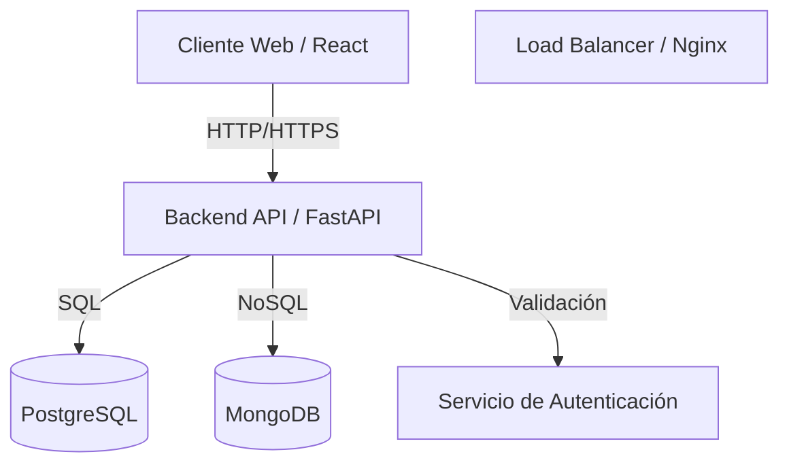

# Diseño del Sistema

## Visión General

El sistema sigue una arquitectura de microservicios moderna, separando claramente el frontend del backend y utilizando contenedores para asegurar consistencia entre entornos.

## Diagrama de Arquitectura

## Componentes

### 1. Frontend (React + Vite)
- **Tecnología**: React 19, Vite, Material UI.
- **Responsabilidad**: Interfaz de usuario, gestión de estado local, comunicación con la API.
- **Comunicación**: Axios para peticiones HTTP RESTful.
- **Contenerización**: Servido via servidor de desarrollo de Vite (dev) o Nginx (prod).

### 2. Backend (FastAPI)
- **Tecnología**: Python 3.10+, FastAPI, SQLAlchemy, Uvicorn.
- **Responsabilidad**: Lógica de negocio, validación de datos, orquestación de servicios.
- **API**: RESTful API documentada automáticamente con OpenAPI (Swagger UI).

### 3. Persistencia de Datos
- **PostgreSQL**: Base de datos relacional primaria.
  - Almacena: Usuarios, Roles, Ejercicios, Rutinas, Progreso estructurado.
- **MongoDB**: Base de datos NoSQL para datos flexibles.
  - Almacena: Logs de sistema, analíticas, datos de eventos temporales.

## Flujos de Datos Principales

### Autenticación
1. Usuario envía credenciales (email/password).
2. Backend valida contra PostgreSQL.
3. Si es válido, genera JWT (Access + Refresh Token).
4. Frontend almacena token y lo usa en cabeceras `Authorization`.

### Gestión de Ejercicios
1. Frontend solicita lista de ejercicios.
2. Backend consulta PostgreSQL.
3. Backend devuelve JSON array.
4. Frontend renderiza componentes de tarjetas.

## Seguridad
- **JWT**: Para autenticación stateless.
- **CORS**: Configurado para permitir peticiones solo desde dominios confiables.
- **Hashing**: Contraseñas hasheadas (bcrypt/argon2) antes de guardar en DB.
- **Validación**: Pydantic asegura que los datos de entrada cumplan los esquemas.
